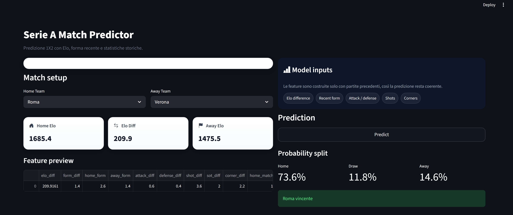

# Serie A Match Predictor

<p align="center">
  
  
  
  
</p>

<p align="center">
  
  
  
</p>

## Overview

This project predicts the result of a Serie A football match using a machine learning pipeline built on historical match data.

The model predicts one of three outcomes:

* `H` = Home win
* `D` = Draw
* `A` = Away win

The system combines:

* historical match statistics
* Elo rating
* recent form features
* a supervised classification model
* a Streamlit dashboard for live prediction

---

## Why this project is interesting

Football prediction is a good real-world ML problem because:

* the data is noisy and time-dependent
* the outcome has three classes instead of two
* the relationship between features and target is non-linear
* predictions must be built only from information available before the match

That makes the project a good example of:

* feature engineering
* time-aware modeling
* classification
* dashboard deployment

---

## Pipeline

```text
CSV files -> cleaning -> temporal ordering -> Elo update -> feature engineering -> training -> Streamlit inference
```

The most important rule is that the model uses only past information to predict the future. This avoids data leakage.

---

## Data

The dataset contains Serie A match records across multiple seasons.

Typical columns include:

* `Date`
* `HomeTeam`
* `AwayTeam`
* `FTR`
* `FTHG`
* `FTAG`
* `HS`
* `AS`
* `HST`
* `AST`
* `HC`
* `AC`
* `B365H`
* `B365D`
* `B365A`

Each row corresponds to one match.

---

## Core logic

### 1. Elo rating

Elo is used to estimate team strength before every match.

Formula:

```text
E_expected = 1 / (1 + 10^((R_opponent - R_team) / 400))
```

Update rule:

```text
R_new = R_old + K * (S - E_expected)
```

Where:

* `R_old` = current rating
* `K` = learning factor
* `S` = actual result (1 win, 0.5 draw, 0 loss)
* `E_expected` = expected score

This makes the rating dynamic over time.

---

### 2. Form features

Recent form is important in football.

The project tracks the last matches of each team and derives features such as:

* `home_form`
* `away_form`
* `form_diff`

A team in better recent form should have a higher probability of winning.

---

### 3. Match statistics

The model also uses match-level indicators such as:

* shots difference
* corners difference
* shots on target difference
* attack and defense differences
* number of matches already played at home / away

These features help the model learn patterns beyond raw team identity.

---

## Mathematical intuition

A football match can be interpreted as a balance between team strength, recent performance, and match statistics.

A simplified view is:

```text
Match Outcome = f(Elo, Form, Attack, Defense, Shots, Corners)
```

The model learns this function from historical examples.

---

## Betting odds

The dataset may also contain bookmaker odds such as:

* `B365H`
* `B365D`
* `B365A`

These are useful because they reflect market expectations.

Example of implied probability:

```text
P ≈ 1 / odds
```

For example:

* `1.80` corresponds to a higher implied probability
* `4.50` corresponds to a lower implied probability

Odds can improve performance, but they also make the model closer to the market.

---

## Model

The project uses:

```python
RandomForestClassifier
```

Why Random Forest:

* works well on tabular data
* handles non-linear relationships
* is robust to noise
* is easy to train and deploy

---

## Feature engineering summary

The final feature vector can include:

```text
elo_diff
home_form
away_form
form_diff
attack_diff
defense_diff
shot_diff
sot_diff
corner_diff
home_matches
away_matches
```

Every feature is computed using only past match data.

---

## Training workflow

```text
1. Load CSV files
2. Merge datasets
3. Clean missing values
4. Sort matches by date
5. Compute Elo sequentially
6. Build feature matrix
7. Split data into train/test
8. Train Random Forest
9. Evaluate accuracy
10. Save model and Elo state
```

---

## Streamlit dashboard

The app lets the user:

* choose home team
* choose away team
* see the Elo values
* inspect the feature vector
* get the predicted class
* see the class probabilities

Example output:

```text
Home Win: 0.48
Draw:     0.27
Away Win:  0.25
```

---

## Repository structure

```text
serie-a-analytics/
│
├── app.py
├── requirements.txt
├── README.md
├── data/
│   └── raw/
│       ├── serie_A_1999-00.csv
│       ├── serie_A_2000-01.csv
│       └── ...
│
├── images/
│   ├── dashboard.png
│   └── prediction-proof.png
│
├── models/
│   ├── model.pkl
│   └── elo.json
│
└── src/
    ├── data_loader.py
    ├── preprocessing.py
    ├── elo.py
    ├── engine.py
    └── train.py
```

---

## How to run

### Install dependencies

```bash
pip install -r requirements.txt
```

### Train the model

```bash
py -m src.train
```

### Launch the dashboard

```bash
py -m streamlit run app.py
```

---

## Expected result

The model usually reaches a realistic accuracy range for football prediction.

Typical values:

* around `0.55` to `0.63` depending on the split and features

In football, accuracy alone is not enough. A well-calibrated probability output is often more useful than a single predicted class.

---

## Project takeaways

This project demonstrates:

* a full end-to-end machine learning pipeline
* time-aware sports modeling
* engineered features based on match history
* model deployment with Streamlit
* practical sports analytics thinking

---

## Future improvements

Possible upgrades:

* XGBoost / LightGBM
* richer form metrics on the last 10 matches
* probability calibration
* expected goals features
* live deployment on Streamlit Cloud
* comparison with bookmaker odds

---

## Example images (demo)

I am adding demo images of the dashboard.

### Dashboard


### Proof


---

## Author

Portfolio project for data science and sports analytics.
